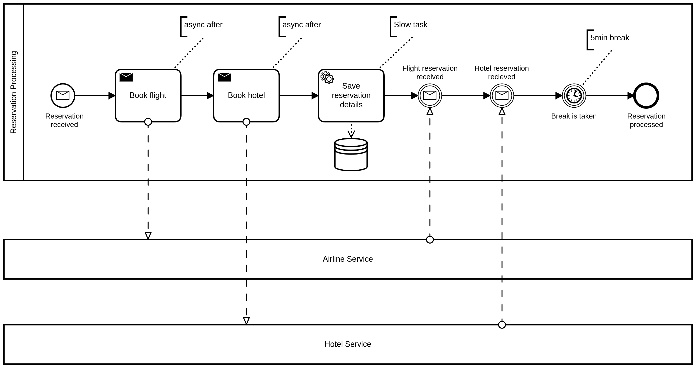
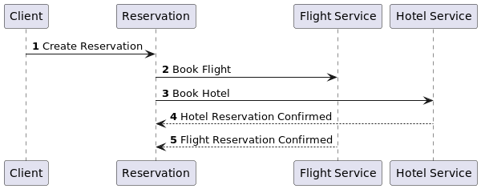

## Working example 

We provide examples demonstrating the usage of the library with different messaging technologies.
The general example is a "Travel Reservation" business process, aiming to book flights and a hotel 
in a target city. The reservation process receives the customer name, the source city, the target city 
and the dates of the travel. Using this information, it requests the flights by the flight service and 
a hotel by the hotel service. The confirmed flight information and hotel information is stored inside 
the process payload variables.

The following sequence diagram illustrates the timing of messages being passed:

As a result, the `HotelReservationConfirmed` is received before `FlightReservationConfirmed` causing a trouble,
if message order is strict and must be preserved. In addition, at the time of the receiving of
the first message, the process has not completed the long-running task of saving the details.

In the following examples we are not focusing on demonstration of features resulting from the 
race conditions (resolved faulty), but on purpose created illegal (unwished) message ordering,
causing to fail the orchestration by design.

### Software requirements to run examples

* Docker
* Docker-Compose
* KCat (formerly known as KafkaCat)
* JQ
* Curl

### Spring Cloud Streams with Kafka

The example demonstrates the usage of the library using Kafka for communication. In doing so,
we rely on the Spring Cloud Streams binding for Kafka. We constructed an example sending and 
receiving data between services using Apache Kafka.

To run the examples, you will need to have Docker installed on your machine. Please first run the
build of the examples and construct the container images...To do so, please run:

`mvn clean install -Pdocker-assembly -f example`

Then start the provided images using the supplied docker-compose file, by running:

`docker-compose -f example/spring-cloud/docker-compose.yml up -d`

This command will start Apache Kafka, Zookeeper, Flight Service and Hotel Service locally.
As a next step, open your IDE and run the 
`io/holunda/camunda/bpm/example/kafka/TravelAgencyKafkaCorrelationApplication.kt` application by 
providing the spring profile `camunda-correlate` (module `example/spring-cloud/reservation-kafka`).

Having it all up-and running, you can send the first message, by using the provided script, which uses 
`kcat`/`kafkacat` and `jq`. Please run:

`example/spring-cloud/example.sh reservation` 

to send the message to the reservation topic. As a result, the process should get started, and you should
see the messages `[SEND BOOK FLIGHT]` and `[SEND BOOK HOTEL]` in your log, indicating that the messages
are sent to corresponding topics. The services are executed delayed (2 secs, 5 secs), during the process 
is executing the long-running task (saving the reservation details lasts 10 seconds), you will see
the response messages coming in. For demonstration purposes, the service delays are configured in a way
that the "expected" answer by the flight is received after the "unexpected" response from the hotel 
is received. Therefor, you will see the exception (`MismatchedCorrelationException`) in the log first.

After this, you can inspect the content of the inbox by calling an endpoint [http://localhost:8080/admin/list-messages/](http://localhost:8080/admin/list-messages/).

### Axon Events aka using Camunda Platform 7 as Microservice Orchestrator

The example demonstrates the usage of the library using Axon Framework / Axon Server based communication. In doing so,
We constructed an example sending and receiving data between services using Axon Command and Event Buses.

To run the examples, you will need to have Docker installed on your machine. Please first run the
build of the examples and construct the container images...To do so, please run:

`mvn clean install -Pdocker-assembly -f example`

Then start the provided images using the supplied docker-compose file, by running:

`docker-compose -f example/axon/docker-compose.yml up -d`

This command will start Axon Server, Flight Service and Hotel Service locally.
As a next step, open your IDE and run the
`io/holunda/camunda/bpm/example/axon/TravelAgencyAxonCorrelationApplication.kt` application (module `example/axon/reservation-axon`).

Having it all up-and running, you can send the first message, by using the provided script, which uses
`curl` and `jq`. Please run:

`example/axon/example.sh reservation`

to send the message to the RESTful endpoit, which will emit an Axon event. As a result, the process should get started, and you should
see the messages `[SEND BOOK FLIGHT]` and `[SEND BOOK HOTEL]` in your log, indicating that the commands
are sent to. The services are executed delayed (2 secs, 5 secs), during the process
is executing the long-running task (saving the reservation details lasts 10 seconds), you will see
the response messages coming in. For demonstration purposes, the service delays are configured in a way
that the "expected" answer by the flight is received after the "unexpected" response from the hotel
is received. Therefor, you will see the exception (`MismatchedCorrelationException`) in the log first.

After this, you can inspect the content of the inbox by calling an endpoint [http://localhost:8080/admin/list-messages/](http://localhost:8080/admin/list-messages/).

